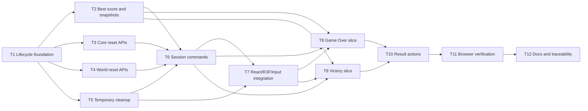

# Epic - commercial-game-loop

> **Spec:** [spec.md](../spec.md) - **Design:** [design.md](../design.md) - **ADR:** [0001](../adr/0001-use-session-controller-for-lifecycle-ownership.md) - **Machine contract:** [tasks.json](../tasks.json)

## Goal

Deliver the complete commercial game loop defined by the accepted specification:
explicit lifecycle states, Game Over and Victory result screens, Play Again and Main
Menu without browser reload, persistent local best score, complete new-session reset,
and deterministic/browser verification.

## Scope

- **In:** lifecycle/session controller, best-score service, result snapshots, reset
  APIs, temporary-effect cleanup, Game Over and Victory result flows, Play Again, Main
  Menu, input/pause gating, R3F frame gating, deterministic tests, Playwright
  lifecycle verification, and feature traceability docs.
- **Out:** backend/accounts/cloud sync, level JSON or balance changes, new gameplay
  modes, mobile controls, broad visual redesign, second frame loop, replacement
  gameplay store, production-only test controls, and full engine rewrite.

## Task map

## Recommended execution order

1. T1 lifecycle foundation.
2. T2, T3, T4, and T5 can proceed after T1; T3, T4, and T5 are independent reset
   lanes, while T2 is the persistence/snapshot lane.
3. T6 coordinates reset and session commands after the persistence and reset lanes.
4. T7 wires lifecycle into React/R3F/input/pause.
5. T8 and T9 deliver Game Over and Victory terminal slices.
6. T10 wires shared terminal actions and accessibility behavior.
7. T11 adds browser verification.
8. T12 finalizes docs and traceability.

## Critical path

T1 -> T2/T3/T4/T5 -> T6 -> T7 -> T8/T9 -> T10 -> T11 -> T12.

## Independent lanes

- T2 best-score/snapshot work can proceed separately from reset APIs once T1 exists.
- T3 core reset, T4 world reset, and T5 temporary cleanup can proceed in parallel after
  T1 if implementers coordinate overlapping tests and shared session files.
- T8 and T9 can proceed in parallel after T2, T6, and T7.

## Expected commit count

Expected implementation commit count: 12 focused commits, one per task. If a
compile-coupled TypeScript interface change makes two adjacent tasks impossible to
commit green independently, implementation may close that pair with one shared gate
and two `SDD-Task` trailers.

## Feature-size reassessment

Recommendation remains `M`. The task count is high for M, but the work is still
bounded to lifecycle, reset seams, result UI, local persistence, and verification. It
should become `L` only if implementation requires centralizing gameplay state or
rewriting engine ownership rather than adding narrow reset/cleanup APIs.

## Maintainer review points

- After T1: confirm lifecycle command semantics and no live gameplay duplication.
- After T3: confirm approved zero-lives semantics and no level JSON changes.
- After T4/T5: confirm reset coverage for mutable world state and temporary effects.
- After T8/T9/T10: review player-facing result screens and action behavior.
- After T11/T12: review final verification evidence before SDD REVIEW.

## Coverage self-check

- FR-01 through FR-14 are assigned in [tracker.md](./tracker.md).
- AC-01 through AC-25 are assigned across `tasks.json` and task files.
- Every state owner from [design.md section 8](../design.md#8-reset-ownership-matrix)
  is assigned to T3, T4, T5, T6, T7, T8, T9, or T10.
- No task requires a full engine rewrite, a second frame loop, duplicated live
  gameplay state, or production-only test hooks.
- Production implementation files are listed only as future `files_hint` surfaces; no
  production code is changed by this TASKS phase.

## Tasks

See [tracker.md](./tracker.md) for status.

| # | Task | Layer | Blocked by | DoD (short) |
|---|---|---|---|---|
| T1 | Add lifecycle controller foundation | app | - | Lifecycle states, transitions, no-ops, and read/subscription APIs are unit-tested. |
| T2 | Add best-score service and terminal snapshots | app | T1 | Best score, failure mapping, and snapshots pass deterministic tests. |
| T3 | Add core session reset APIs | domain | T1 | Core state reset APIs are exact, idempotent, and tested. |
| T4 | Add world-state reset APIs | domain | T1 | World, bonus, obstacle, render, and animation resets are exact and tested. |
| T5 | Add session temporary-effect cleanup | app | T1 | Temporary handles and stale-session guards are tested with fake timers where useful. |
| T6 | Coordinate session reset and session commands | app | T2, T3, T4, T5 | Start, Play Again, Main Menu, reset orchestration, and 10 cycles pass. |
| T7 | Integrate lifecycle with React, R3F, input, and pause | wiring | T5, T6 | Frame/input/pause wiring is lifecycle-gated and StrictMode-safe. |
| T8 | Deliver Game Over result slice | ui | T2, T6, T7 | Game Over snapshot, UI, input guard, and reload removal work. |
| T9 | Deliver Victory result slice | ui | T2, T6, T7 | Victory snapshot, persistent UI, actions, and reload removal work. |
| T10 | Wire result actions and accessible lifecycle UI | ui | T8, T9 | Play Again/Main Menu actions are accessible and state-safe. |
| T11 | Add browser lifecycle verification | tests | T10 | Playwright verifies representative lifecycle behavior and no reload. |
| T12 | Finalize documentation and traceability | docs | T11 | Docs record verification, traceability, and remaining risks. |

